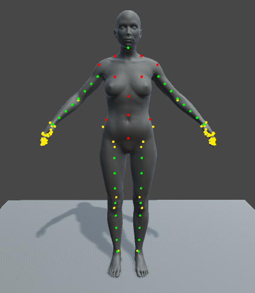
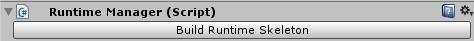
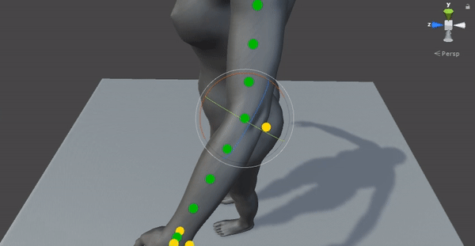
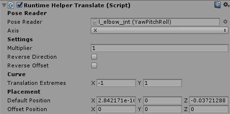
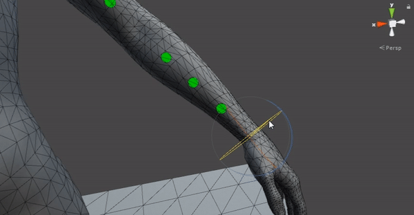
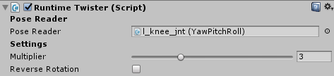
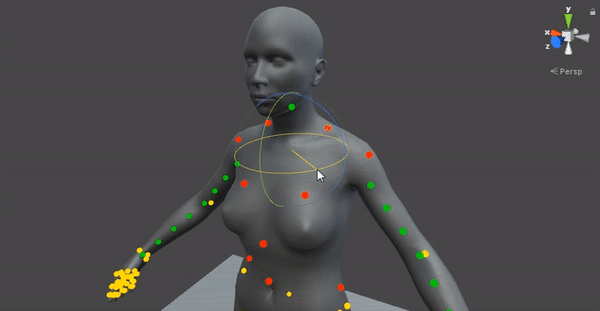
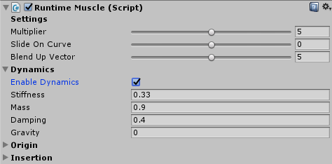

# unity-another-auto-rigger
Unity scripts for the Another Auto Rigger system.

 
<i>Runtime Joints Debug Display <a href="Examples/runtimeJointsDebug.gif">( Click for GIF )</a></i>

## Runtime Manager
The auto rigger contains a lot of helper joints, these helper joints are not going to be driven by the Unity's Mecanim system. The runtime manager script allows you to apply the .skeletonPreset file exported in Maya to the skeleton in Unity. It will apply scripts to the helper joints and set the correct settings coming from Maya meaning the deformation will be identical between the two applications. Once this process is done the helper joints are driven by joints that are controlled by the Mecanim system.

 
<i>Runtime Manager Inspector</i>

## Runtime Helper
The runtime helper setup contains 2 different scripts. The helper joints are used to preserve volume in areas like the hips, knee, wrist, elbow etc.

 
<i>Runtime Helper Example</i>

 
<i>Runtime Helper Translate Inspector</i>

 
<i>Runtime Helper Aim Inspector</i>

## Runtime Twister
The runtime twister can split the twist value of a parent joint and only apply a fraction of that to the helper joint. This is another runtime joint that is used to preserve volume.

 
<i>Runtime Twister Example</i>

 
<i>Runtime Twister Inspector</i>

## Runtime Muscle
The runtime muscle is the more complex of the runtime joints. It mimics the behaviour of a muscle, it has a origin and an insertion point driven by parent joints. This script also features an option that is not available in Maya, it is possible to make the joint dynamic. The dynamics will add a natural jiggle to the joint which boosts realism.

 
<i>Runtime Muscle Example</i>

 
<i>Runtime Muscle Inspector</i>

### Credits
* Modelling Topology: <a href="http://www.makehuman.org">Make Human</a>
* Modelling: <a href="https://www.artstation.com/mfalzon"><strong>Michael Falzon</strong></a>
* Animation: <a href="https://assetstore.unity.com/packages/3d/animations/everyday-motion-pack-free-115067">Everyday Motion Pack Free</a>
